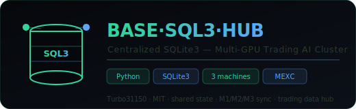

<div align="center">
  
  <br/><br/>

  [](LICENSE)
  [](#)
  [](#)
  [](#)
  [](#)

  <br/>
  <p><strong>Base SQLite3 centralisée pour le cluster trading IA Multi-GPU · 3 machines · Sync temps réel · MEXC prix live</strong></p>
  <p><em>Hub de données partagé entre M1/M2/M3 — état commun du cluster, prix MEXC, signaux, logs</em></p>
</div>

---

## Présentation

**BASE·SQL3·HUB** est la base de données SQLite3 centralisée du cluster trading JARVIS. Elle maintient un état cohérent entre les 3 machines (M1/M2/M3), stocke les prix MEXC en temps réel, les signaux de trading, les logs d'agents et les métriques de performance.

---

## Schéma

```sql
-- Tables principales
CREATE TABLE prices (
    symbol TEXT, price REAL, volume REAL,
    timestamp INTEGER, source TEXT
);

CREATE TABLE signals (
    id TEXT PRIMARY KEY, symbol TEXT, type TEXT,
    score INTEGER, ia_votes TEXT, timestamp INTEGER
);

CREATE TABLE positions (
    symbol TEXT, side TEXT, entry REAL,
    size REAL, tp1 REAL, tp2 REAL, sl REAL,
    status TEXT, opened_at INTEGER
);

CREATE TABLE cluster_state (
    node TEXT, status TEXT, gpu_util REAL,
    ram_mb INTEGER, last_ping INTEGER
);

CREATE TABLE agent_logs (
    agent TEXT, action TEXT, result TEXT,
    timestamp INTEGER
);
```

---

## Synchronisation inter-machines

```python
from base_sql3 import ClusterDB

# Connexion depuis n'importe quel nœud
db = ClusterDB(
    master="192.168.1.10",   # M1
    local_path="/data/trading.db",
    sync_interval=5          # secondes
)

# Écriture (répliquée automatiquement)
db.insert_price('BTC/USDT', 94500.0, volume=1_250_000)
db.insert_signal('BTC/USDT', 'BREAKOUT', score=82)

# Lecture (local + fallback master)
positions = db.get_open_positions()
```

---

## Installation

```bash
git clone https://github.com/Turbo31150/BASE-SQL3-COMMUNE.git
cd BASE-SQL3-COMMUNE
pip install -r requirements.txt
# Configurer: M1_HOST, M2_HOST, M3_HOST dans config.py
python setup_db.py      # Initialise le schéma
python sync_daemon.py   # Lance la synchronisation
```

---

<div align="center">

**Franc Delmas (Turbo31150)** · [github.com/Turbo31150](https://github.com/Turbo31150) · MIT License

</div>
